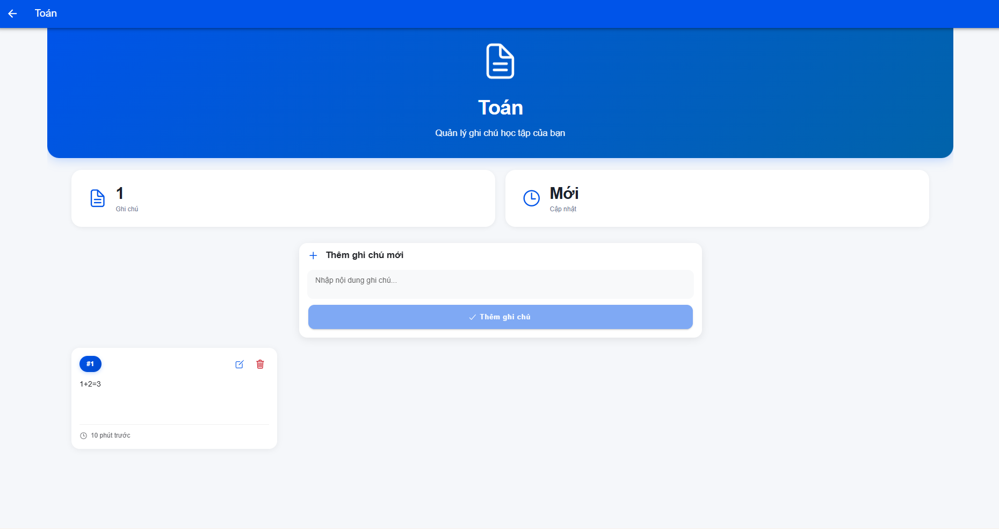

# Study Notes - Ứng dụng Ghi chú học tập

## Thông tin sinh viên

- **Họ và tên**: Đinh Lê Thái Dương
- **MSSV**: 22IT056
- **Lớp**: 22SE2
- **Đề tài**: Đề 4 - Ứng dụng Ghi chú học tập (Study Notes)

## Tính năng chính

### 1. Màn hình chính (Home)

- Hiển thị danh sách các môn học: Toán, Lý, Hóa, Anh, CNTT
- Điều hướng sang màn hình ghi chú khi chọn môn

### 2. Màn hình ghi chú (Notes)

- Nhận tham số `subject` từ URL
- Hiển thị danh sách ghi chú của môn học đó
- Form nhập ghi chú mới với validation
- Thêm ghi chú mới (Enter hoặc nút Thêm)
- Xóa ghi chú bằng cách vuốt sang trái
- Tự động lưu và reload danh sách
- Toast notifications cho các thao tác
- Empty state khi chưa có ghi chú

### 3. Lưu trữ dữ liệu

- Sử dụng `@capacitor/preferences` (chính thức từ Capacitor 7)
- Lưu theo format: `notes_<subject>` với giá trị JSON string
- Service class `NotesStorage` để quản lý
- Hỗ trợ CRUD operations đầy đủ

## Cài đặt và Chạy dự án

### 1. Cài đặt dependencies

```bash
npm install
```

### 2. Cài đặt Capacitor Preferences (đã có trong package.json)

```bash
npm install @capacitor/preferences
```

### 3. Build project

```bash
npm run build
```

### 4. Sync với Capacitor

```bash
npx cap sync
```

### 5. Chạy trên trình duyệt (Development)

```bash
ionic serve
```

hoặc

```bash
npm run dev
```

Ứng dụng sẽ chạy tại: http://localhost:5173

### 6. Chạy trên Android

#### Mở Android Studio:

```bash
npx cap open android
```

#### Hoặc chạy trực tiếp:

```bash
npx cap run android
```





## Screenshots

### Màn hình Home
*Hình 1: Danh sách các môn học với thiết kế card hiện đại*


### Màn hình Notes - Danh sách ghi chú
*Hình 2: Hiển thị các ghi chú đã lưu của môn học*


### Màn hình Notes - Thêm ghi chú
*Hình 3: Form nhập ghi chú mới với validation*


### Màn hình Notes - Chỉnh sửa ghi chú
*Hình 4: Modal chỉnh sửa nội dung ghi chú*


## Công nghệ sử dụng

- **Framework**: Ionic 8.5.0 + React 19.0.0
- **Build Tool**: Vite
- **Mobile Framework**: Capacitor 7.4.4
- **Storage**: @capacitor/preferences 7.0.2
- **Routing**: React Router 5.3.4
- **Language**: TypeScript 5.1.6

## Cấu trúc dự án

```
study-notes/
├── src/
│   ├── App.tsx                    # Component chính
│   ├── data/
│   │   └── subjects.ts            # Danh sách môn học
│   ├── pages/
│   │   ├── Home.tsx               # Trang chủ
│   │   ├── Home.css               # Styles trang chủ
│   │   ├── Notes.tsx              # Trang ghi chú
│   │   └── Notes.css              # Styles trang ghi chú
│   └── services/
│       └── notesStorage.ts        # Service lưu trữ
├── capacitor.config.ts            # Cấu hình Capacitor
├── package.json                   # Dependencies
└── README.md                      # Tài liệu
```

## Tác giả

**Đinh Lê Thái Dương** - 22IT056 - Lớp 22SE2

---

*Đồ án giữa kỳ môn Phát triển ứng dụng di động nâng cao - HK7*
